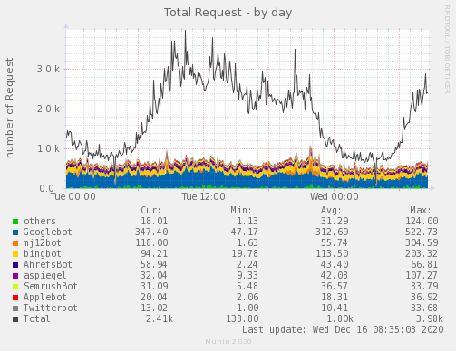

# munin-crawlers

## It's for monitoring the Bot Crawlers request in real time

Using the graphic interface of munin, we can check how many requests our platform received from crawlers

__Custom Values__

* __limitloglines__ number of lines like tail -n
* __botstrings__ array of strings to get bots
* __listuseragents__ array of bots to classify

__For Apache Logs__

```
LogFormat "{ \"time\":\"%t\", \"remoteIP\":\"%{X-Forwarded-For}i\", \"host\":\"%V\", \
"request\":\"%U\", \"query\":\"%q\", \"method\":\"%m\", \"status\":\"%>s\", \"userAgent\":
\"%{User-agent}i\", \"referer\":\"%{Referer}i\", \"req_time\":\"%D\" }" jsonlog
SetEnvIf X-Forwarded-For "^.*\..*\..*\..*" forwarded
CustomLog "logs/access.log" jsonlog env=forwarded
```

__For munin-node config__

```
[munin-crawler]
group root
env.file_name /var/log/httpd/access.log
```

__Install__

```
cd /etc/munin/plugins
ln -s /usr/share/munin/plugins/munin-crawler.py munin-crawler
```

__Screen__


